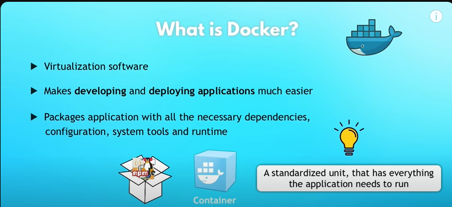

# Overview Of Docker

### (1) What is Docker and why is it used?
### (2) Docker vs Virtual Machines
### (3) Install Docker Locally
### (4) Images Vs Containers
### (5) Public and Private Registries
### (6) Run Containers
   - ### (6.1) Pull and Run Containers From Public Repo
   - ### (6.2) Port Binding, Detached Mode etc.
### (7) Create Own Image (Docker File)
   - ### (7.1) Syntax and Concepts Of Dockerfile
### (8) Main Docker Commands
   - ### (8.1) Pull,Run,Start,Stop,Logs,Build
### (9) Image Versioning

# =====================================

# (1) What is Docker and why is it used?

## What is Docker ?
   - ### Docker is a containerization platform that allows developers to package applications and their dependencies into a standardized unit called a container.
   - ### Containers provide consistency across different environments, making it easier to develop, deploy, and scale applications.

## Why Docker?

   ### Portability: 
   - #### Containers can run on any platform that supports Docker, making it easy to move applications between environments.

   ### Isolation: 
   - #### Containers provide process isolation, ensuring that applications run consistently regardless of the underlying infrastructure.
   
   ### Efficiency:
   - #### Containers share the host operating system kernel, resulting in lightweight and efficient deployments.

   ### Scalability:
   - #### Docker containers can be quickly spun up or down, allowing for dynamic scaling of applications based on demand.